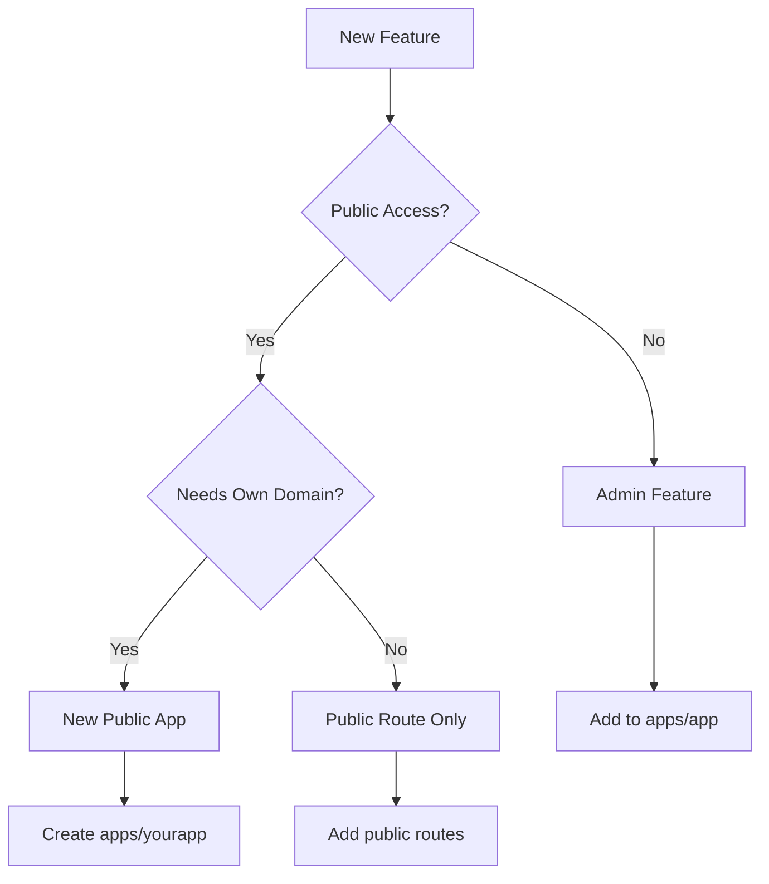

# NEW APP GUIDELINES

A comprehensive guide for spinning up new applications in the barely.ai monorepo. This document provides exhaustive instructions for creating both admin-facing features (within apps/app) and public-facing applications (standalone apps like vip, fm, page).

## Table of Contents

1. [Quick Decision Tree](#quick-decision-tree)
2. [Core Architecture Patterns](#core-architecture-patterns)
3. [Creating a Public-Facing App](#creating-a-public-facing-app)
4. [Adding Admin Features](#adding-admin-features)
5. [Database Integration](#database-integration)
6. [tRPC Implementation Guide](#trpc-implementation-guide)
7. [Configuration Checklist](#configuration-checklist)
8. [Common Pitfalls & Solutions](#common-pitfalls--solutions)
9. [File Templates](#file-templates)
10. [Testing & Deployment](#testing--deployment)

## Quick Decision Tree

### What Are You Building?



- **Admin Feature** (e.g., team management, internal analytics): Add to `apps/app`
- **Public App** (e.g., link-in-bio, landing pages): Create new app in `apps/`
- **Hybrid** (e.g., VIP with admin + public): Both admin routes AND public app

## Core Architecture Patterns

### Dual Router Architecture

Every feature with public access requires TWO separate router implementations:

1. **Admin Router** (`packages/lib/src/trpc/routes/[feature].route.ts`)
   - Workspace-scoped operations
   - Full CRUD capabilities
   - Protected by authentication
   - Rich data relationships

2. **Public Router** (`packages/lib/src/trpc/routes/[feature]-render.route.ts`)
   - Anonymous access
   - Read-only operations
   - Rate limiting
   - Minimal data exposure

### Monorepo Structure

```
barely/
├── apps/
│   ├── app/                    # Main admin dashboard
│   ├── [yourapp]/              # Your new public app
│   └── ...other apps
├── packages/
│   ├── api/                    # API handlers and public routers
│   ├── db/                     # Database schemas
│   ├── lib/                    # Business logic and tRPC routes
│   ├── validators/             # Zod schemas
│   └── ...other packages
```

## Creating a Public-Facing App

### Step 1: Plan Your Architecture

Before writing any code, determine:

1. **App name**: Choose a short, descriptive name (e.g., `vip`, `fm`, `link`)
2. **Port assignment**: Check existing ports and assign next available:
   - Current: app(3000), cart(3002), fm(3003), link(3004), page(3007), press(3008), vip(3009), www(3010)
   - Your app: Next available port (e.g., 3011)
3. **Database needs**: List all entities and relationships
4. **Route structure**: Define public vs admin operations

### Step 2: Create Database Schema

#### 2.1 Create SQL definitions

```typescript
// packages/db/src/sql/[entity-name].sql.ts
import { relations } from 'drizzle-orm';
import { boolean, index, pgTable, text, timestamp, uniqueIndex } from 'drizzle-orm/pg-core';
import { dbId, primaryId } from '../utils/sql';
import { Workspaces } from './workspace.sql';

export const YourEntities = pgTable(
  'YourEntities',
  {
    ...primaryId,
    
    // Workspace association (required for admin features)
    workspaceId: dbId('workspaceId')
      .notNull()
      .references(() => Workspaces.id, { onDelete: 'cascade' }),
    
    // Your fields
    name: text('name').notNull(),
    slug: text('slug').notNull(),
    isPublic: boolean('isPublic').notNull().default(false),
    
    // Metadata
    metadata: text('metadata').$type<Record<string, unknown>>(),
    
    // Soft delete
    deletedAt: timestamp('deletedAt'),
    
    // Add your custom fields here
  },
  table => ({
    workspace: index('YourEntities_workspace_idx').on(table.workspaceId),
    slug: uniqueIndex('YourEntities_slug_idx').on(table.slug),
  }),
);

// Relations
export const YourEntities_Relations = relations(YourEntities, ({ one, many }) => ({
  workspace: one(Workspaces, {
    fields: [YourEntities.workspaceId],
    references: [Workspaces.id],
  }),
}));

// Type exports
export type YourEntity = typeof YourEntities.$inferSelect;
export type InsertYourEntity = typeof YourEntities.$inferInsert;
```

#### 2.2 Register in database client

```typescript
// packages/db/src/client.ts
import { YourEntities, YourEntities_Relations } from './sql/your-entity.sql';

export const dbSchema = {
  // ... existing schemas
  YourEntities,
  YourEntities_Relations,
};
```

### Step 3: Create Validation Schemas

The validators package uses `drizzle-zod` to automatically generate Zod schemas from your Drizzle table definitions. This ensures type safety and reduces boilerplate.

```typescript
// packages/validators/src/schemas/[entity-name].schema.ts
import type { InferSelectModel } from 'drizzle-orm';
import type { z } from 'zod/v4';
import { YourEntities } from '@barely/db/sql';
import { createInsertSchema, createSelectSchema } from 'drizzle-zod';

import {
  commonFiltersSchema,
  infiniteQuerySchema,
  querySelectionSchema,
} from '../helpers';

// Generate schemas from Drizzle table definition
export const insertYourEntitySchema = createInsertSchema(YourEntities, {
  // Add custom validation for specific fields
  name: name => name.min(1, 'Name is required'),
  slug: slug => slug.min(1, 'Slug is required').regex(/^[a-z0-9-]+$/, 'Invalid slug format'),
});

// Standard CRUD schemas
export const createYourEntitySchema = insertYourEntitySchema.omit({
  id: true,
  workspaceId: true,
});

export const upsertYourEntitySchema = insertYourEntitySchema.partial({
  id: true,
  workspaceId: true,
});

export const updateYourEntitySchema = insertYourEntitySchema
  .partial()
  .required({ id: true });

// Select schema (rarely needed, types are usually inferred)
export const selectYourEntitySchema = createSelectSchema(YourEntities);

// Type exports using Drizzle inference
export type YourEntity = InferSelectModel<typeof YourEntities>;
export type InsertYourEntity = z.infer<typeof insertYourEntitySchema>;
export type CreateYourEntity = z.infer<typeof createYourEntitySchema>;
export type UpsertYourEntity = z.infer<typeof upsertYourEntitySchema>;
export type UpdateYourEntity = z.infer<typeof updateYourEntitySchema>;

// Filter and query schemas
export const yourEntityFilterSchema = commonFiltersSchema.extend({
  // Add entity-specific filters here
  status: z.enum(['draft', 'published', 'archived']).optional(),
});

export const yourEntitySearchParamsSchema = yourEntityFilterSchema.extend({
  selectedIds: querySelectionSchema.optional(),
});

export const selectWorkspaceYourEntitiesSchema = yourEntitySearchParamsSchema.extend(
  infiniteQuerySchema.shape,
);

// Public schemas (for public-facing apps)
export const publicYourEntitySchema = selectYourEntitySchema
  .pick({
    name: true,
    slug: true,
    // Only expose necessary public fields
  })
  .extend({
    // Add computed/transformed fields if needed
    displayName: z.string().optional(),
  });

export type PublicYourEntity = z.infer<typeof publicYourEntitySchema>;

// Default values for forms
export const defaultYourEntity: CreateYourEntity = {
  name: '',
  slug: '',
  isPublic: false,
};
```

#### Register validators

```typescript
// packages/validators/src/schemas/index.ts
export * from './your-entity.schema';
```

#### Common Helper Schemas

The validators package provides reusable helper schemas in `packages/validators/src/helpers/`:

- **`commonFiltersSchema`** - Standard search, showArchived, showDeleted filters
- **`infiniteQuerySchema`** - Pagination with cursor, limit, and handle
- **`querySelectionSchema`** - Tracks selected items in lists
- **`sortOrderSchema`** - 'asc' | 'desc' sorting
- **`queryBooleanSchema`** - Converts string "true"/"false" to boolean
- **`platformFiltersSchema`** - Platform-specific filters (Spotify, Apple Music, etc.)

Always extend these base schemas rather than creating new ones from scratch.

### Step 4: Create tRPC Routes

The tRPC routes follow strict patterns for consistency, type safety, and performance. Always use `TRPCRouterRecord` for type safety and follow the established naming conventions.

#### Database Client Usage Guidelines

**Choose the right database client based on your operation:**

- **`dbHttp`** - Use for single-shot operations (one read OR one write)
- **`dbPool(ctx.pool)`** - Use for multi-shot operations:
  - Multiple reads or writes in the same procedure
  - Transactions
  - Complex operations with multiple queries
  - Operations that might benefit from connection reuse

#### 4.1 Admin routes (workspace-scoped)

```typescript
// packages/lib/src/trpc/routes/[entity-name].route.ts
import type { TRPCRouterRecord } from '@trpc/server';
import { dbHttp } from '@barely/db/client';
import { dbPool } from '@barely/db/pool';
import { YourEntities, RelatedTable } from '@barely/db/sql';
import { sqlAnd, sqlCount, sqlStringContains } from '@barely/db/utils';
import { newId, raise } from '@barely/utils';
import { 
  createYourEntitySchema,
  selectWorkspaceYourEntitiesSchema,
  updateYourEntitySchema,
} from '@barely/validators';
import { TRPCError } from '@trpc/server';
import { and, asc, desc, eq, gt, inArray, isNull, lt, or } from 'drizzle-orm';
import { z } from 'zod/v4';

import { workspaceProcedure } from '../trpc';

export const yourEntityRoute = {
  // Paginated list with cursor-based pagination
  byWorkspace: workspaceProcedure
    .input(selectWorkspaceYourEntitiesSchema)
    .query(async ({ input, ctx }) => {
      const { limit, cursor, search, showArchived, showDeleted } = input;
      
      // Use dbHttp for single read operation
      const entities = await dbHttp.query.YourEntities.findMany({
        with: {
          // Load relations if needed
          relatedItems: true,
        },
        where: sqlAnd([
          eq(YourEntities.workspaceId, ctx.workspace.id),
          showArchived ? undefined : isNull(YourEntities.archivedAt),
          showDeleted ? undefined : isNull(YourEntities.deletedAt),
          !!search?.length && sqlStringContains(YourEntities.name, search),
          // Cursor pagination
          !!cursor &&
            or(
              lt(YourEntities.createdAt, cursor.createdAt),
              and(eq(YourEntities.createdAt, cursor.createdAt), gt(YourEntities.id, cursor.id)),
            ),
        ]),
        orderBy: [desc(YourEntities.createdAt), asc(YourEntities.id)],
        limit: limit + 1, // Fetch one extra to check for next page
      });
      
      let nextCursor: typeof cursor | undefined = undefined;
      
      if (entities.length > limit) {
        const nextEntity = entities.pop();
        if (nextEntity) {
          nextCursor = {
            id: nextEntity.id,
            createdAt: nextEntity.createdAt,
          };
        }
      }
      
      return {
        entities,
        nextCursor,
      };
    }),

  // Get total count
  totalByWorkspace: workspaceProcedure.query(async ({ ctx }) => {
    // Single read - use dbHttp
    const res = await dbHttp
      .select({ count: sqlCount })
      .from(YourEntities)
      .where(eq(YourEntities.workspaceId, ctx.workspace.id));
    
    return res[0]?.count ?? 0;
  }),

  // Get single entity by ID
  byId: workspaceProcedure
    .input(z.object({ id: z.string() }))
    .query(async ({ input, ctx }) => {
      // Single read - use dbHttp
      const entity = await dbHttp.query.YourEntities.findFirst({
        where: and(
          eq(YourEntities.id, input.id),
          eq(YourEntities.workspaceId, ctx.workspace.id),
          isNull(YourEntities.deletedAt),
        ),
        with: {
          relatedItems: true,
        },
      });
      
      if (!entity) {
        throw new TRPCError({
          code: 'NOT_FOUND',
          message: 'Entity not found',
        });
      }
      
      return entity;
    }),

  // Create with validation
  create: workspaceProcedure
    .input(createYourEntitySchema)
    .mutation(async ({ input, ctx }) => {
      const { relatedIds, ...data } = input;
      
      // Multiple operations - use dbPool
      const pool = dbPool(ctx.pool);
      
      // Check for duplicates
      const existing = await pool.query.YourEntities.findFirst({
        where: and(
          eq(YourEntities.workspaceId, ctx.workspace.id),
          eq(YourEntities.slug, data.slug),
          isNull(YourEntities.deletedAt),
        ),
      });
      
      if (existing) {
        raise('An entity with this slug already exists');
      }
      
      const entityData = {
        ...data,
        id: newId('yourEntity'),
        workspaceId: ctx.workspace.id,
      };
      
      // Transaction for multiple writes
      const result = await pool.transaction(async tx => {
        const [entity] = await tx
          .insert(YourEntities)
          .values(entityData)
          .returning();
        
        // Handle many-to-many relations
        if (relatedIds?.length) {
          await tx.insert(YourEntities_To_RelatedItems).values(
            relatedIds.map(relatedId => ({
              yourEntityId: entity.id,
              relatedId,
            })),
          );
        }
        
        return entity;
      });
      
      return result ?? raise('Failed to create entity');
    }),

  // Update with complex logic
  update: workspaceProcedure
    .input(updateYourEntitySchema)
    .mutation(async ({ input, ctx }) => {
      const { id, relatedIds, ...data } = input;
      
      // Multiple operations - use dbPool
      const pool = dbPool(ctx.pool);
      
      await pool.transaction(async tx => {
        // Update main entity
        const [updated] = await tx
          .update(YourEntities)
          .set(data)
          .where(
            and(
              eq(YourEntities.id, id),
              eq(YourEntities.workspaceId, ctx.workspace.id),
            ),
          )
          .returning();
        
        if (!updated) {
          throw new TRPCError({ code: 'NOT_FOUND' });
        }
        
        // Update relations if provided
        if (relatedIds) {
          // Remove old relations
          await tx
            .delete(YourEntities_To_RelatedItems)
            .where(eq(YourEntities_To_RelatedItems.yourEntityId, id));
          
          // Add new relations
          if (relatedIds.length > 0) {
            await tx.insert(YourEntities_To_RelatedItems).values(
              relatedIds.map(relatedId => ({
                yourEntityId: id,
                relatedId,
              })),
            );
          }
        }
        
        return updated;
      });
    }),

  // Batch operations
  archive: workspaceProcedure
    .input(z.object({ ids: z.array(z.string()) }))
    .mutation(async ({ input, ctx }) => {
      // Single write - use dbHttp
      const updated = await dbHttp
        .update(YourEntities)
        .set({ archivedAt: new Date() })
        .where(
          and(
            eq(YourEntities.workspaceId, ctx.workspace.id),
            inArray(YourEntities.id, input.ids),
          ),
        )
        .returning();
      
      return updated[0] ?? raise('Failed to archive entities');
    }),

  delete: workspaceProcedure
    .input(z.object({ ids: z.array(z.string()) }))
    .mutation(async ({ input, ctx }) => {
      // Single write - use dbHttp
      const updated = await dbHttp
        .update(YourEntities)
        .set({ deletedAt: new Date() })
        .where(
          and(
            eq(YourEntities.workspaceId, ctx.workspace.id),
            inArray(YourEntities.id, input.ids),
          ),
        )
        .returning();
      
      return updated[0] ?? raise('Failed to delete entities');
    }),
} satisfies TRPCRouterRecord;
```

#### 4.2 Public routes (anonymous access)

Public routes come in two types: **render routes** (for event logging) and **public data routes** (for data operations).

##### Render Routes (Event Logging)

Render routes are minimal and primarily used for tracking/analytics:

```typescript
// packages/lib/src/trpc/routes/[entity-name]-render.route.ts
import type { TRPCRouterRecord } from '@trpc/server';
import { WEB_EVENT_TYPES__PAGE } from '@barely/const';
import { dbHttp } from '@barely/db/client';
import { YourEntities } from '@barely/db/sql';
import { publicProcedure } from '@barely/lib/trpc';
import { raise } from '@barely/utils';
import { eq } from 'drizzle-orm';
import { z } from 'zod/v4';

import { recordPageEvent } from '../../functions/event.fns';

export const yourEntityRenderRoute = {
  // Primary purpose: log events for analytics
  log: publicProcedure
    .input(
      z.object({
        entityId: z.string(),
        type: z.enum(WEB_EVENT_TYPES__PAGE),
        linkClickParams: z.object({
          platform: z.string(),
        }).optional(),
      }),
    )
    .mutation(async ({ ctx, input }) => {
      const { visitor } = ctx;
      const { entityId, type } = input;
      
      // Single read - use dbHttp
      const entity = await dbHttp.query.YourEntities.findFirst({
        where: eq(YourEntities.id, entityId),
        with: {
          workspace: {
            columns: {
              id: true,
              plan: true,
              eventUsage: true,
              eventUsageLimitOverride: true,
            },
          },
        },
      }) ?? raise('Entity not found');
      
      await recordPageEvent({
        page: entity,
        type,
        visitor,
        workspace: entity.workspace,
      });
    }),
} satisfies TRPCRouterRecord;
```

##### Public Data Routes

For actual data operations, create separate public routes with handle/key patterns:

```typescript
// packages/lib/src/trpc/routes/[entity-name].route.ts (public procedures section)
import type { TRPCRouterRecord } from '@trpc/server';
import { dbHttp } from '@barely/db/client';
import { dbPool } from '@barely/db/pool';
import { YourEntities } from '@barely/db/sql';
import { publicProcedure } from '@barely/lib/trpc';
import { newId, raise } from '@barely/utils';
import { TRPCError } from '@trpc/server';
import { and, eq, isNull } from 'drizzle-orm';
import { z } from 'zod/v4';

import { ratelimit } from '../../integrations/upstash';

export const yourEntityRoute = {
  // Public data access by handle and key
  byHandleAndKey: publicProcedure
    .input(z.object({ 
      handle: z.string(),
      key: z.string(),
    }))
    .query(async ({ input }) => {
      const { handle, key } = input;
      
      // Single read - use dbHttp
      const entity = await dbHttp.query.YourEntities.findFirst({
        where: and(
          eq(YourEntities.handle, handle),
          eq(YourEntities.key, key),
          eq(YourEntities.isActive, true),
          isNull(YourEntities.deletedAt),
        ),
        with: {
          coverImage: true,
          file: true,
          workspace: true,
        },
      });
      
      if (!entity) {
        throw new TRPCError({
          code: 'NOT_FOUND',
          message: 'Content not found',
        });
      }
      
      return entity;
    }),

  // Alternative: access by ID and params
  byIdAndParams: publicProcedure
    .input(z.object({ 
      id: z.string(),
      handle: z.string(),
      key: z.string(),
    }))
    .query(async ({ input, ctx }) => {
      // Multiple reads - use dbPool
      const pool = dbPool(ctx.pool);
      
      const entity = await pool.query.YourEntities.findFirst({
        where: and(
          eq(YourEntities.handle, input.handle),
          eq(YourEntities.key, input.key),
        ),
        with: {
          workspace: true,
          relatedItems: {
            where: eq(RelatedItems.id, input.id),
            limit: 1,
          },
        },
      });
      
      if (!entity) {
        throw new TRPCError({
          code: 'NOT_FOUND',
          message: 'Not found',
        });
      }
      
      return entity;
    }),

  // Public mutation with email capture
  submitForm: publicProcedure
    .input(
      z.object({
        entityId: z.string(),
        email: z.email(),
        data: z.record(z.string()).optional(),
      }),
    )
    .mutation(async ({ ctx, input }) => {
      const { entityId, email, data } = input;
      
      // Rate limit by IP
      const { success } = await ratelimit(3, '1 h').limit(
        `form.${entityId}.${ctx.visitor?.ip ?? '127.0.0.1'}`,
      );
      
      if (!success) {
        throw new TRPCError({
          code: 'TOO_MANY_REQUESTS',
          message: 'Too many submissions. Please try again later.',
        });
      }
      
      // Multiple operations - use dbPool
      const pool = dbPool(ctx.pool);
      
      // Get entity and workspace
      const entity = await pool.query.YourEntities.findFirst({
        where: and(
          eq(YourEntities.id, entityId),
          eq(YourEntities.isPublic, true),
        ),
        with: { workspace: true },
      });
      
      if (!entity) {
        throw new TRPCError({
          code: 'NOT_FOUND',
          message: 'Form not found.',
        });
      }
      
      // Create or update fan
      const fanId = newId('fan');
      await pool
        .insert(Fans)
        .values({
          id: fanId,
          workspaceId: entity.workspaceId,
          email,
          emailMarketingOptIn: true,
          appReferer: 'yourapp',
          metadata: data,
        })
        .onConflictDoUpdate({
          target: [Fans.email, Fans.workspaceId],
          set: {
            emailMarketingOptIn: true,
            updatedAt: new Date(),
          },
        });
      
      // Log submission event
      await pool.insert(FormSubmissions).values({
        id: newId('formSubmission'),
        entityId,
        fanId,
        data,
        visitorId: ctx.visitor?.id,
      });
      
      // Send confirmation email
      await sendEmail({
        to: email,
        subject: 'Thank you for your submission',
        // ... email template
      });
      
      return { success: true };
    }),
} satisfies TRPCRouterRecord;
```

#### 4.3 Register routes in main router

```typescript
// packages/lib/src/trpc/trpc.ts
import { yourEntityRoute } from './routes/your-entity.route';

export const appRouter = createTRPCRouter({
  // ... existing routes
  yourEntity: yourEntityRoute,
});
```

#### Common Route Patterns

##### Sorting with Complex Cursors

When implementing sorting by fields other than createdAt, you need complex cursor logic:

```typescript
// Helper for building cursor WHERE clauses
function getCursorWhereClause(
  cursor: { id: string; createdAt: Date; sortField: number | null },
  sortBy: 'name' | 'popularity' | 'date',
  sortOrder: 'asc' | 'desc',
) {
  const isDesc = sortOrder === 'desc';
  
  if (sortBy === 'popularity' && cursor.sortField !== null) {
    return or(
      isDesc 
        ? lt(YourEntities.popularity, cursor.sortField)
        : gt(YourEntities.popularity, cursor.sortField),
      and(
        eq(YourEntities.popularity, cursor.sortField),
        or(
          lt(YourEntities.createdAt, cursor.createdAt),
          and(eq(YourEntities.createdAt, cursor.createdAt), lt(YourEntities.id, cursor.id)),
        ),
      ),
    );
  }
  
  // Default cursor logic for other sort types
  return or(
    isDesc 
      ? lt(YourEntities.createdAt, cursor.createdAt)
      : gt(YourEntities.createdAt, cursor.createdAt),
    and(
      eq(YourEntities.createdAt, cursor.createdAt),
      isDesc ? lt(YourEntities.id, cursor.id) : gt(YourEntities.id, cursor.id),
    ),
  );
}
```

##### Helper Functions for Complex Data

Create helper functions in `packages/lib/src/functions/[entity].fns.ts`:

```typescript
// packages/lib/src/functions/your-entity.fns.ts
import type { YourEntityWith_Relations } from '@barely/validators';

export async function getYourEntityById(id: string) {
  const entity = await dbHttp.query.YourEntities.findFirst({
    where: eq(YourEntities.id, id),
    with: {
      workspace: true,
      relatedItems: {
        with: {
          item: true,
        },
      },
    },
  });
  
  return entity ? formatYourEntity(entity) : null;
}

export function formatYourEntity(
  rawEntity: RawYourEntityWith_Relations,
): YourEntityWith_Relations {
  return {
    ...rawEntity,
    relatedItems: rawEntity.relatedItems.map(r => r.item),
    // Transform nested data as needed
  };
}

export async function createYourEntity(
  data: CreateYourEntity,
  workspaceId: string,
  pool: DbPool,
) {
  return await pool.transaction(async tx => {
    // Complex creation logic
    const entity = await tx.insert(YourEntities).values({
      id: newId('yourEntity'),
      workspaceId,
      ...data,
    }).returning();
    
    // Handle related data
    // ...
    
    return entity[0];
  });
}
```

##### Real-time Updates with Pusher

```typescript
import { pushEvent } from '../../integrations/pusher/pusher-server';

// In your mutation
await pushEvent('yourEntity', 'update', {
  id: entity.id,
  pageSessionId: ctx.pageSessionId,
  socketId: ctx.pusherSocketId,
});
```

##### Background Jobs with Trigger.dev

```typescript
import { tasks } from '@trigger.dev/sdk/v3';

// Trigger a background job
await tasks.trigger<typeof processYourEntity>('process-your-entity', {
  entityId: entity.id,
  workspaceId: ctx.workspace.id,
});
```

##### Private Procedures for Internal Use

```typescript
import { privateProcedure } from '../trpc';

export const yourEntityRoute = {
  // Internal procedure not exposed to workspace users
  _internal_cleanup: privateProcedure
    .input(z.object({ days: z.number() }))
    .mutation(async ({ input, ctx }) => {
      // Cleanup logic that shouldn't be workspace-scoped
      const cutoffDate = new Date();
      cutoffDate.setDate(cutoffDate.getDate() - input.days);
      
      await dbPool(ctx.pool)
        .delete(YourEntities)
        .where(lt(YourEntities.deletedAt, cutoffDate));
    }),
};
```

#### Key Naming Conventions

Always follow these naming patterns for consistency:

- **`byWorkspace`** - Get paginated list for a workspace
- **`byId`** - Get single item by ID
- **`bySlug`** - Get by slug (usually public)
- **`totalByWorkspace`** - Get count for workspace
- **`create`** - Create new item
- **`update`** - Update existing item
- **`archive`** - Soft archive (set archivedAt)
- **`delete`** - Soft delete (set deletedAt)
- **`restore`** - Restore archived/deleted item
- **`duplicate`** - Clone an item
- **Custom operations** - Use descriptive names (e.g., `exportToCsv`, `importFromFile`, `generateReport`)

### Step 5: Create Public Router Infrastructure

#### 5.1 Create public router

```typescript
// packages/api/src/public/[app-name]-render.router.ts
import { yourEntityRenderRoute } from '@barely/lib/trpc/routes/your-entity-render.route';
import { createTRPCRouter } from '@barely/lib/trpc/api/trpc';

export const yourAppRenderRouter = createTRPCRouter({
  entity: yourEntityRenderRoute,
  // Add other public routes here
});

export type YourAppRenderRouter = typeof yourAppRenderRouter;
```

#### 5.2 Create React hooks

```typescript
// packages/api/src/public/[app-name]-render.trpc.react.ts
import type { YourAppRenderRouter } from './your-app-render.router';
import { createTRPCContext } from '@barely/lib/trpc/context/createTRPCContext.react';

export const {
  Provider: YourAppTRPCProvider,
  useTRPC: useYourAppRenderTRPC,
} = createTRPCContext<YourAppRenderRouter>();
```

#### 5.3 Create API handler

```typescript
// packages/api/src/public/[app-name]-render.handler.ts
import { publicRenderHandler } from '@barely/lib/server/api/public-render-handler';
import { yourAppRenderRouter } from './your-app-render.router';

export const yourAppRenderHandler = publicRenderHandler({
  app: 'yourapp',
  path: 'yourAppRender',
  router: yourAppRenderRouter,
});
```

### Step 6: Create the App

#### 6.1 Initialize app structure

```bash
# Create app directory
mkdir -p apps/yourapp/src/app

# Copy configuration files from existing app
cp -r apps/vip/{package.json,tsconfig.json,tailwind.config.ts,postcss.config.cjs,next.config.mjs,turbo.json,eslint.config.js} apps/yourapp/

# Update package.json with your app name
```

#### 6.2 Create package.json

```json
{
  "name": "@barely/yourapp",
  "version": "0.1.0",
  "private": true,
  "type": "module",
  "scripts": {
    "dev": "pnpm with-env next dev --experimental-https --port=3011",
    "build": "pnpm with-env next build",
    "build:preview": "pnpm with-env vercel build",
    "build:production": "pnpm with-env vercel build --prod",
    "preview": "pnpm with-env next start",
    "type-check": "tsc --noEmit",
    "with-env": "dotenv -e ../../.env --"
  },
  "dependencies": {
    "@barely/api": "workspace:*",
    "@barely/auth": "workspace:*",
    "@barely/db": "workspace:*",
    "@barely/email": "workspace:*",
    "@barely/hooks": "workspace:*",
    "@barely/lib": "workspace:*",
    "@barely/ui": "workspace:*",
    "@barely/utils": "workspace:*",
    "@barely/validators": "workspace:*",
    "@tanstack/react-query": "catalog:",
    "@tanstack/react-query-devtools": "^5.80.10",
    "@trpc/client": "catalog:",
    "@trpc/server": "catalog:",
    "lucide-react": "^0.441.0",
    "next": "^15.3.4",
    "react": "catalog:react19",
    "react-dom": "catalog:react19",
    "superjson": "^2.2.1",
    "tailwindcss": "catalog:",
    "zod": "catalog:"
  },
  "devDependencies": {
    "@barely/tailwind-config": "workspace:*",
    "@next/eslint-plugin-next": "^15.3.4",
    "@types/node": "catalog:",
    "@types/react": "catalog:react19",
    "@types/react-dom": "catalog:react19",
    "dotenv-cli": "^8.0.0",
    "eslint": "catalog:",
    "postcss": "catalog:",
    "typescript": "catalog:"
  }
}
```

#### 6.3 Create tRPC client setup

```typescript
// apps/yourapp/src/trpc/query-client.tsx
'use client';

import { QueryClient } from '@tanstack/react-query';

function makeQueryClient() {
  return new QueryClient({
    defaultOptions: {
      queries: {
        staleTime: 60 * 1000, // 1 minute
        refetchOnWindowFocus: false,
      },
    },
  });
}

let browserQueryClient: QueryClient | undefined = undefined;

export function getQueryClient() {
  if (typeof window === 'undefined') {
    return makeQueryClient();
  } else {
    if (!browserQueryClient) browserQueryClient = makeQueryClient();
    return browserQueryClient;
  }
}
```

```typescript
// apps/yourapp/src/trpc/react.tsx
'use client';

import type { ReactNode } from 'react';
import { useState } from 'react';
import { QueryClientProvider } from '@tanstack/react-query';
import { ReactQueryDevtools } from '@tanstack/react-query-devtools';
import { YourAppTRPCProvider, useYourAppRenderTRPC } from '@barely/api/public/your-app-render.trpc.react';
import { httpBatchLink } from '@trpc/client';
import SuperJSON from 'superjson';
import { getQueryClient } from './query-client';

export { useYourAppRenderTRPC };

export function TRPCReactProvider({ children }: { children: ReactNode }) {
  const queryClient = getQueryClient();
  
  const [trpcClient] = useState(() =>
    useYourAppRenderTRPC.createClient({
      links: [
        httpBatchLink({
          url: `/api/trpc/yourAppRender`,
          transformer: SuperJSON,
        }),
      ],
    }),
  );

  return (
    <YourAppTRPCProvider client={trpcClient} queryClient={queryClient}>
      <QueryClientProvider client={queryClient}>
        {children}
        <ReactQueryDevtools />
      </QueryClientProvider>
    </YourAppTRPCProvider>
  );
}
```

```typescript
// apps/yourapp/src/trpc/server.tsx
import { cache } from 'react';
import { headers } from 'next/headers';
import { useYourAppRenderTRPC } from '@barely/api/public/your-app-render.trpc.react';
import { httpBatchLink } from '@trpc/client';
import SuperJSON from 'superjson';

export const getServerTRPC = cache(async () => {
  const heads = await headers();
  
  return useYourAppRenderTRPC.createCaller({
    links: [
      httpBatchLink({
        url: `${process.env.NEXT_PUBLIC_YOURAPP_BASE_URL}/api/trpc/yourAppRender`,
        headers() {
          const newHeaders = new Map(heads);
          newHeaders.set('x-trpc-source', 'rsc');
          return Object.fromEntries(newHeaders);
        },
        transformer: SuperJSON,
      }),
    ],
  });
});
```

#### 6.4 Create API route handler

```typescript
// apps/yourapp/src/app/api/trpc/yourAppRender/[trpc]/route.ts
import { yourAppRenderHandler } from '@barely/api/public/your-app-render.handler';

export { yourAppRenderHandler as GET, yourAppRenderHandler as POST };
```

#### 6.5 Create root layout

```typescript
// apps/yourapp/src/app/layout.tsx
import type { Metadata } from 'next';
import type { ReactNode } from 'react';
import { TRPCReactProvider } from '~/trpc/react';
import '../styles/globals.css';

export const metadata: Metadata = {
  title: 'Your App',
  description: 'Your app description',
};

export default function RootLayout({ children }: { children: ReactNode }) {
  return (
    <html lang="en">
      <body>
        <TRPCReactProvider>
          {children}
        </TRPCReactProvider>
      </body>
    </html>
  );
}
```

#### 6.6 Create styles

```css
/* apps/yourapp/src/styles/globals.css */
@tailwind base;
@tailwind components;
@tailwind utilities;
```

### Step 7: Update Configuration Files

#### 7.1 Add to app constants

```typescript
// packages/const/src/app.constants.ts
export const APPS = [
  'app',
  'cart',
  'fm',
  'link',
  'page',
  'press',
  'www',
  'nyc',
  'vip',
  'yourapp', // Add your app here
] as const;
```

#### 7.2 Update authentication URLs

```typescript
// packages/auth/src/get-url.ts
export function getBaseUrl(app: App, opts?: { absolute?: boolean }) {
  // ... existing code
  
  if (isDevelopment()) {
    const portMap = {
      app: process.env.NEXT_PUBLIC_APP_DEV_PORT ?? '3000',
      // ... other apps
      yourapp: process.env.NEXT_PUBLIC_YOURAPP_DEV_PORT ?? '3011',
    };
    // ... rest of function
  }
  
  // Production URLs
  const urlMap = {
    app: process.env.NEXT_PUBLIC_APP_BASE_URL ?? 'https://app.barely.ai',
    // ... other apps
    yourapp: process.env.NEXT_PUBLIC_YOURAPP_BASE_URL ?? 'https://yourapp.barely.ai',
  };
  // ...
}
```

#### 7.3 Add environment variables

```typescript
// packages/auth/env.ts
const client = z.object({
  // ... existing vars
  NEXT_PUBLIC_YOURAPP_BASE_URL: z.string().min(1).optional(),
  NEXT_PUBLIC_YOURAPP_DEV_PORT: z.string().min(1).optional(),
});

export const env = createEnv({
  // ... existing config
  experimental__runtimeEnv: {
    // ... existing vars
    NEXT_PUBLIC_YOURAPP_BASE_URL: process.env.NEXT_PUBLIC_YOURAPP_BASE_URL,
    NEXT_PUBLIC_YOURAPP_DEV_PORT: process.env.NEXT_PUBLIC_YOURAPP_DEV_PORT,
  },
});
```

#### 7.4 Update development scripts

```bash
# scripts/dev-qr-codes.sh
# Add your app to the APPS array
APPS=("app:3000" "cart:3002" "fm:3003" "link:3004" "page:3007" "press:3008" "vip:3009" "www:3010" "nyc:3006" "yourapp:3011")
```

#### 7.5 Add ID prefix

```typescript
// packages/utils/src/id.ts
const prefixes = {
  // ... existing prefixes
  yourEntity: 'ye',
} as const;
```

### Step 8: Create Admin UI (if needed)

If your feature needs admin management, add pages to `apps/app`:

```typescript
// apps/app/src/app/[handle]/yourentities/page.tsx
'use client';

import { useWorkspace } from '@barely/hooks/use-workspace';
import { useQuery } from '@tanstack/react-query';
import { trpc } from '~/trpc/react';

export default function YourEntitiesPage() {
  const { workspace } = useWorkspace();
  
  const { data: entities } = useQuery({
    ...trpc.yourEntity.list.queryOptions({ limit: 50 }),
    enabled: !!workspace,
  });
  
  return (
    <div>
      <h1>Your Entities</h1>
      {/* Your UI here */}
    </div>
  );
}
```

## Adding Admin Features

For features that only need admin access (no public app):

### Step 1: Database & Validation
Follow steps 2-3 from "Creating a Public-Facing App"

### Step 2: Create Admin Routes Only
Create only the admin routes in `packages/lib/src/trpc/routes/[feature].route.ts`

### Step 3: Add to Admin App
Create pages in `apps/app/src/app/[handle]/[feature]/`

## Database Integration

### Migration Strategy

#### Development
```bash
# After creating/modifying schemas
pnpm db:push        # Push schema to dev database
pnpm db:studio      # Open Drizzle Studio to verify
```

#### Production
```bash
# Generate migration files
pnpm db:generate

# Review generated SQL in packages/db/drizzle/
# Deploy via CI/CD pipeline
```

### Relationships Pattern

```typescript
// One-to-many
export const Parent_Relations = relations(Parents, ({ many }) => ({
  children: many(Children),
}));

export const Child_Relations = relations(Children, ({ one }) => ({
  parent: one(Parents, {
    fields: [Children.parentId],
    references: [Parents.id],
  }),
}));

// Many-to-many (via junction table)
export const ItemTags = pgTable('ItemTags', {
  itemId: dbId('itemId').references(() => Items.id),
  tagId: dbId('tagId').references(() => Tags.id),
}, table => ({
  pk: primaryKey(table.itemId, table.tagId),
}));
```

## tRPC Implementation Guide

### Query vs Mutation Decision Tree

```
Is it changing data? → Mutation
Is it fetching data? → Query
```

### Using tRPC in React Components

```typescript
'use client';

import { useYourAppRenderTRPC } from '@barely/api/public/your-app-render.trpc.react';
import { useQuery, useMutation } from '@tanstack/react-query';

export function YourComponent() {
  const trpc = useYourAppRenderTRPC();
  
  // Query
  const { data, isLoading, error } = useQuery({
    ...trpc.entity.bySlug.queryOptions({ slug: 'example' }),
    enabled: !!slug, // Conditional fetching
  });
  
  // Mutation
  const { mutate, isPending } = useMutation({
    ...trpc.entity.create.mutationOptions(),
    onSuccess: (data) => {
      console.log('Created:', data);
      // Invalidate queries if needed
    },
    onError: (error) => {
      console.error('Error:', error);
    },
  });
  
  return <div>{/* Your UI */}</div>;
}
```

### Server-Side tRPC

```typescript
// In Server Components
import { getServerTRPC } from '~/trpc/server';

export default async function Page({ params }) {
  const trpc = await getServerTRPC();
  const data = await trpc.entity.bySlug({ slug: params.slug });
  
  return <div>{/* Use data */}</div>;
}
```

## Configuration Checklist

Before considering your app complete, verify:

### Required Files
- [ ] Database schema in `packages/db/src/sql/`
- [ ] Validation schemas in `packages/validators/src/schemas/`
- [ ] Admin routes in `packages/lib/src/trpc/routes/` (if needed)
- [ ] Public routes in `packages/lib/src/trpc/routes/` with `-render` suffix
- [ ] Public router in `packages/api/src/public/[app]-render.router.ts`
- [ ] React hooks in `packages/api/src/public/[app]-render.trpc.react.ts`
- [ ] Handler in `packages/api/src/public/[app]-render.handler.ts`
- [ ] App structure in `apps/[yourapp]/`

### Configuration Updates
- [ ] Added to `APPS` in `packages/const/src/app.constants.ts`
- [ ] URL handling in `packages/auth/src/get-url.ts`
- [ ] Environment variables in `packages/auth/env.ts`
- [ ] Port in `scripts/dev-qr-codes.sh`
- [ ] ID prefix in `packages/utils/src/id.ts`
- [ ] Database client import in `packages/db/src/client.ts`
- [ ] Validator export in `packages/validators/src/schemas/index.ts`

### Package.json Dependencies
- [ ] Core packages (@barely/*)
- [ ] TanStack Query
- [ ] tRPC packages (client, server, NOT react-query)
- [ ] SuperJSON
- [ ] Next.js and React

## Common Pitfalls & Solutions

### TypeScript Issues

#### Problem: Type assertions and `any`
**NEVER DO THIS:**
```typescript
const data = response as any; // ❌ FORBIDDEN
```

**DO THIS INSTEAD:**
```typescript
// Define proper types
const data = yourSchema.parse(response); // ✅
```

#### Problem: User agent can be string or object
```typescript
// Handle both cases
const userAgent = typeof ctx.visitor?.userAgent === 'string' 
  ? ctx.visitor.userAgent 
  : ctx.visitor?.userAgent?.ua ?? null;
```

### Import Issues

#### Problem: Wrong UI import paths
```typescript
// ❌ WRONG
import { Button } from '@barely/ui/elements/button';

// ✅ CORRECT
import { Button } from '@barely/ui/button';
```

#### Problem: Missing tRPC package
```typescript
// ❌ NEVER add this to package.json
"@trpc/react-query": "^11.0.0"

// ✅ Use these instead
"@trpc/client": "catalog:"
"@trpc/server": "catalog:"
```

### Database Issues

#### Problem: Forgetting workspace scope
```typescript
// ❌ WRONG - No workspace check
const item = await db.query.Items.findFirst({
  where: eq(Items.id, input.id),
});

// ✅ CORRECT - Workspace scoped
const item = await db.query.Items.findFirst({
  where: and(
    eq(Items.id, input.id),
    eq(Items.workspaceId, ctx.workspace.id),
  ),
});
```

### Build Issues

#### Problem: Environment variables not available
```typescript
// Ensure all env vars are in:
// 1. packages/auth/env.ts (schema)
// 2. .env.local (values)
// 3. Vercel dashboard (production)
```

## File Templates

### Minimal Public App Template

```typescript
// apps/[app]/src/app/[handle]/[feature]/page.tsx
'use client';

import { useYourAppRenderTRPC } from '@barely/api/public/your-app-render.trpc.react';
import { useQuery } from '@tanstack/react-query';

export default function FeaturePage({ 
  params 
}: { 
  params: { handle: string; key: string } 
}) {
  const trpc = useYourAppRenderTRPC();
  
  const { data, isLoading } = useQuery({
    ...trpc.entity.bySlug.queryOptions({ 
      slug: params.handle,
      key: params.key,
    }),
  });
  
  if (isLoading) return <div>Loading...</div>;
  if (!data) return <div>Not found</div>;
  
  return (
    <div>
      <h1>{data.name}</h1>
      {/* Your content */}
    </div>
  );
}
```

### Form Component Template

```typescript
'use client';

import type { CreateYourEntity } from '@barely/validators/schemas';
import { useZodForm } from '@barely/hooks';
import { createYourEntitySchema } from '@barely/validators/schemas';
import { Form, SubmitButton } from '@barely/ui/forms/form';
import { TextField } from '@barely/ui/forms/text-field';
import { CheckboxField } from '@barely/ui/forms/checkbox-field';
import { useMutation } from '@tanstack/react-query';

export function CreateEntityForm() {
  const form = useZodForm({
    schema: createYourEntitySchema,
    defaultValues: {
      name: '',
      slug: '',
      isPublic: false,
    },
  });
  
  const { mutate, isPending } = useMutation({
    ...trpc.yourEntity.create.mutationOptions(),
    onSuccess: () => {
      form.reset();
      // Handle success
    },
  });
  
  return (
    <Form form={form} onSubmit={mutate}>
      <TextField
        control={form.control}
        name="name"
        label="Name"
        placeholder="Enter name"
      />
      
      <TextField
        control={form.control}
        name="slug"
        label="URL Slug"
        placeholder="url-slug"
      />
      
      <CheckboxField
        control={form.control}
        name="isPublic"
        label="Make publicly accessible"
      />
      
      <SubmitButton loading={isPending}>
        Create
      </SubmitButton>
    </Form>
  );
}
```

## Testing & Deployment

### Local Development

```bash
# Install dependencies
pnpm install

# Run your app
pnpm dev:yourapp

# Or run all services
pnpm dev
```

### Testing Checklist

#### Unit Tests
```typescript
// packages/lib/src/trpc/routes/__tests__/your-entity.route.test.ts
import { describe, it, expect } from 'vitest';
// Test your routes
```

#### Integration Tests
- [ ] Create entity via admin
- [ ] View entity publicly
- [ ] Update entity
- [ ] Delete entity
- [ ] Verify workspace isolation

### Pre-Deployment Checklist

- [ ] Run type checking: `pnpm typecheck`
- [ ] Run linting: `pnpm lint`
- [ ] Run tests: `pnpm test`
- [ ] Test build: `pnpm build`
- [ ] Verify environment variables in Vercel
- [ ] Test public routes with rate limiting
- [ ] Verify error handling

### Deployment

```bash
# Deploy to staging
git push origin feature/your-app

# CI/CD will:
# 1. Run tests
# 2. Build app
# 3. Deploy preview to Vercel

# After approval, merge to main
# Production deployment is automatic
```

## Advanced Patterns

### Adding Analytics

```typescript
// In public routes
await ctx.tb.events.logEvent({
  workspaceId: item.workspaceId,
  type: 'yourEntity__view',
  entityId: item.id,
  visitorId: ctx.visitor?.id,
  // Metadata
  properties: {
    source: ctx.visitor?.referer,
    device: ctx.visitor?.device,
  },
});
```

### Rate Limiting

```typescript
// Built into publicProcedure
// Configure in packages/lib/src/middleware/rate-limit.ts
```

### Background Jobs

```typescript
// packages/lib/src/trigger/your-job.trigger.ts
import { task } from '@trigger.dev/sdk/v3';

export const yourBackgroundJob = task({
  id: 'your-background-job',
  run: async (payload: { entityId: string }) => {
    // Process in background
  },
});

// Trigger from route
await yourBackgroundJob.trigger({ entityId: item.id });
```

### Multi-tenancy Patterns

```typescript
// Always scope by workspace
const workspace = ctx.workspace; // From workspaceProcedure

// For public access, get workspace from entity
const entity = await getEntity(slug);
const workspace = await getWorkspace(entity.workspaceId);
```

## Troubleshooting Guide

### "Module not found" errors
1. Check package.json dependencies
2. Run `pnpm install`
3. Verify imports use correct paths

### "Type error" in tRPC
1. Ensure schemas match between client and server
2. Run `pnpm typecheck` to identify issues
3. Never use type assertions

### "Workspace not found"
1. Verify authentication is working
2. Check workspaceProcedure is used
3. Ensure workspace exists in database

### Build failures
1. Check all environment variables
2. Verify no circular dependencies
3. Run `pnpm build` locally first

## Final Checklist

Before marking your app as complete:

### Functionality
- [ ] All CRUD operations work
- [ ] Public routes are accessible
- [ ] Admin routes are protected
- [ ] Data is properly scoped by workspace

### Code Quality
- [ ] No TypeScript errors
- [ ] No ESLint warnings
- [ ] Tests pass
- [ ] Build succeeds

### Security
- [ ] Input validation on all endpoints
- [ ] Rate limiting on public routes
- [ ] Proper error messages (no data leaks)
- [ ] Environment variables secured

### Performance
- [ ] Database queries optimized
- [ ] Proper caching implemented
- [ ] Loading states handled
- [ ] Error boundaries in place

### Documentation
- [ ] README in app folder
- [ ] API documentation
- [ ] Deployment notes
- [ ] Known issues documented

---

## Quick Reference Card

### Commands
```bash
pnpm dev:yourapp          # Run your app
pnpm db:push             # Update database
pnpm typecheck           # Check types
pnpm lint                # Lint code
pnpm test                # Run tests
pnpm build               # Build app
```

### File Locations
- Database: `packages/db/src/sql/`
- Validators: `packages/validators/src/schemas/`
- Admin Routes: `packages/lib/src/trpc/routes/`
- Public Routes: `packages/lib/src/trpc/routes/[name]-render.route.ts`
- Public Router: `packages/api/src/public/`
- App Code: `apps/[yourapp]/src/`

### Port Assignments
- 3000: app
- 3002: cart
- 3003: fm
- 3004: link
- 3007: page
- 3008: press
- 3009: vip
- 3010: www
- 3011+: Available for new apps

---

This guide represents the complete knowledge needed to create new applications in the barely.ai monorepo. Follow these patterns precisely to avoid common pitfalls and ensure smooth integration with the existing infrastructure.