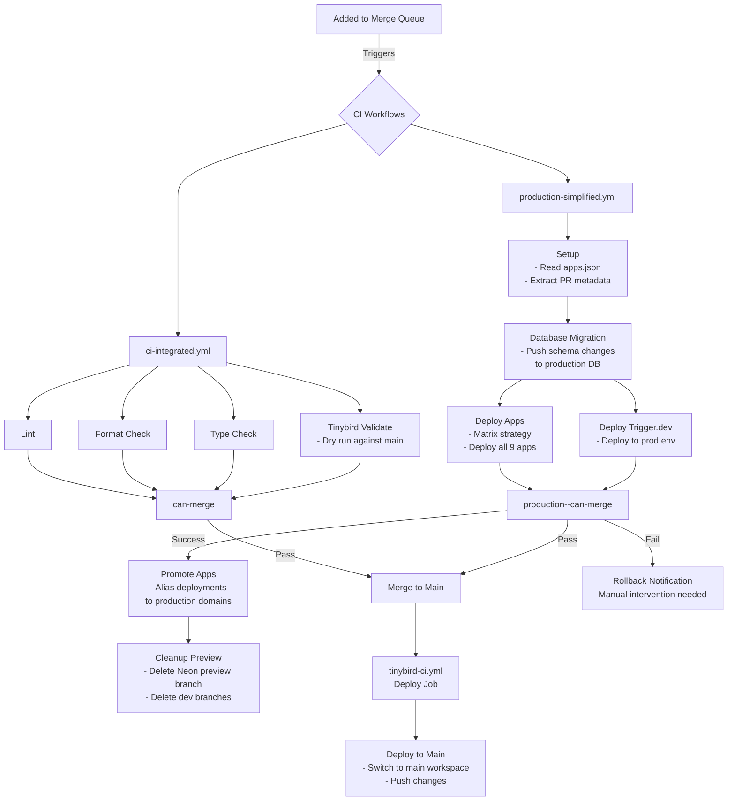

# CI/CD Flow Diagram

## Pull Request Flow

```mermaid
flowchart TD
    PR[Pull Request Created/Updated] --> |Triggers| CI{CI Workflows}
    
    CI --> CI1[ci-integrated.yml]
    CI --> PREV[preview-simplified.yml]
    CI --> TB[tinybird-ci.yml<br/>if external/tinybird/* changed]
    
    %% CI Integrated Flow
    CI1 --> LINT[Lint]
    CI1 --> FORMAT[Format Check]
    CI1 --> TYPE[Type Check]
    
    LINT --> CANMERGE1[can-merge]
    FORMAT --> CANMERGE1
    TYPE --> CANMERGE1
    
    %% Preview Flow
    PREV --> SETUP[Setup<br/>- Read apps.json<br/>- Extract git metadata]
    SETUP --> NEON[Create Neon Branch<br/>- Create preview DB branch<br/>- Get database URL]
    
    NEON --> VERCELENV[Update Vercel Env<br/>- Set DATABASE_URL for all apps<br/>- Parallel updates via script]
    
    VERCELENV --> DEPLOY[Deploy Apps<br/>- Matrix strategy<br/>- Deploy all 9 apps in parallel]
    
    DEPLOY --> TRIGGER[Deploy Trigger.dev<br/>- Deploy to preview env]
    
    DEPLOY --> PREVCANMERGE[preview--can-merge]
    TRIGGER --> PREVCANMERGE
    
    %% Tinybird Flow
    TB --> TBSETUP[Create/Use CI Branch<br/>ci_pr_${PR_NUMBER}]
    TBSETUP --> TBPUSH[Push & Validate<br/>- Push changes to branch<br/>- Show diff]
    
    %% Status Checks
    CANMERGE1 --> |Required Check| STATUS[PR Status Checks]
    PREVCANMERGE --> |Required Check| STATUS
    TBPUSH --> |If Tinybird files changed| STATUS
    
    STATUS --> |All Pass| READY[Ready to Merge]
    
    %% PR Close
    PR --> |Closed/Merged| CLEANUP{Cleanup}
    CLEANUP --> NEONCLEAN[Delete Neon Branch]
    CLEANUP --> TBCLEAN[Delete Tinybird Branch<br/>if labeled 'tinybird']
```

## Merge to Main Flow (via Merge Queue)



## Key Features

### Parallel Execution
- **Preview**: All 9 apps deploy simultaneously using matrix strategy
- **Vercel Env Updates**: Bash script updates all apps in parallel
- **CI Checks**: Lint, format, and typecheck run in parallel

### Resource Management
- **Neon Branches**: Created for each PR, deleted after merge
- **Tinybird Branches**: Created for PRs touching Tinybird files
- **Vercel Deployments**: Preview deployments cleaned up automatically

### Required Status Checks
1. **For PRs**:
   - `can-merge` (from ci-integrated.yml)
   - `preview--can-merge` (from preview-simplified.yml)
   - Tinybird validation (if files changed)

2. **For Merge Queue**:
   - `can-merge` (includes Tinybird dry-run)
   - `production--can-merge`

### Workflow Triggers

| Workflow | PR Created/Updated | Merge Queue | Push to Main | PR Closed |
|----------|-------------------|-------------|--------------|-----------|
| ci-integrated.yml | ✓ | ✓ | - | - |
| preview-simplified.yml | ✓ | ✓ | - | ✓ (cleanup) |
| production-simplified.yml | - | ✓ | - | - |
| tinybird-ci.yml | ✓* | - | ✓* | ✓* (cleanup) |

*Only when external/tinybird/* files are changed

### Configuration Files
- `.github/apps.json` - Central app configuration
- `.github/scripts/update-vercel-env.sh` - Parallel env updates
- `.github/workflows/shared-*.yml` - Reusable workflow components